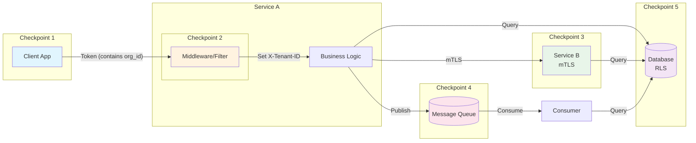
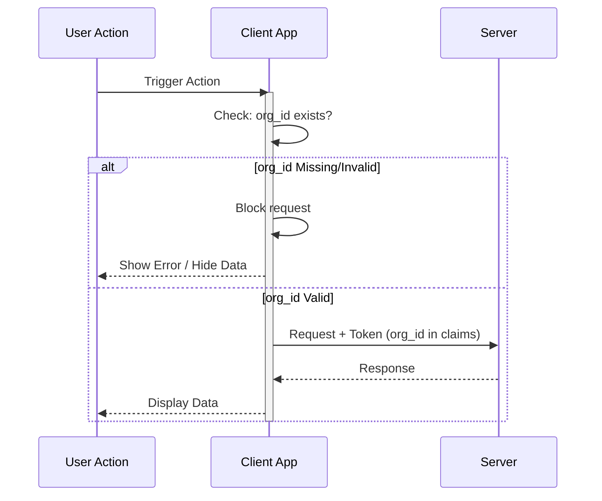
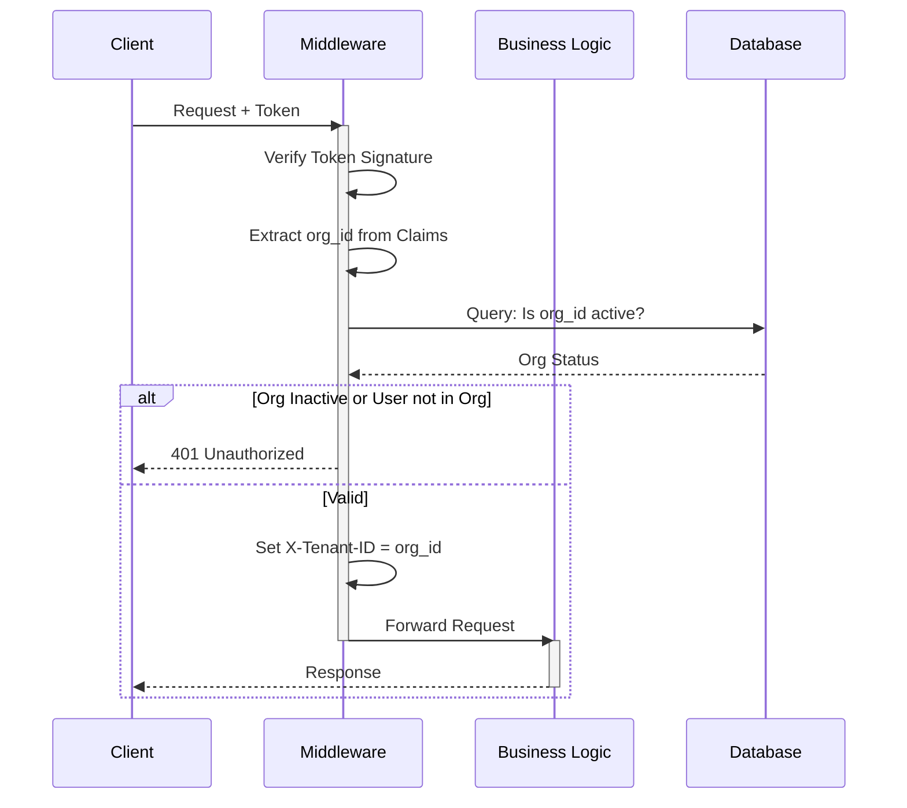
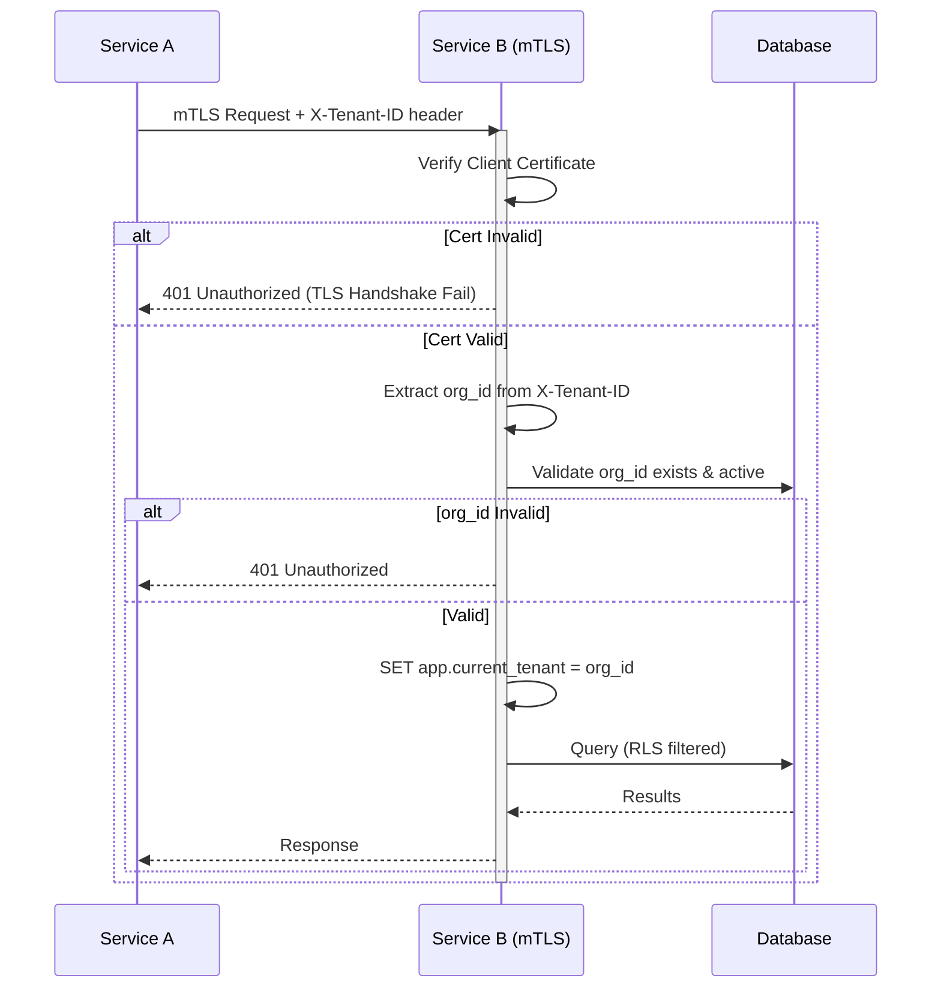
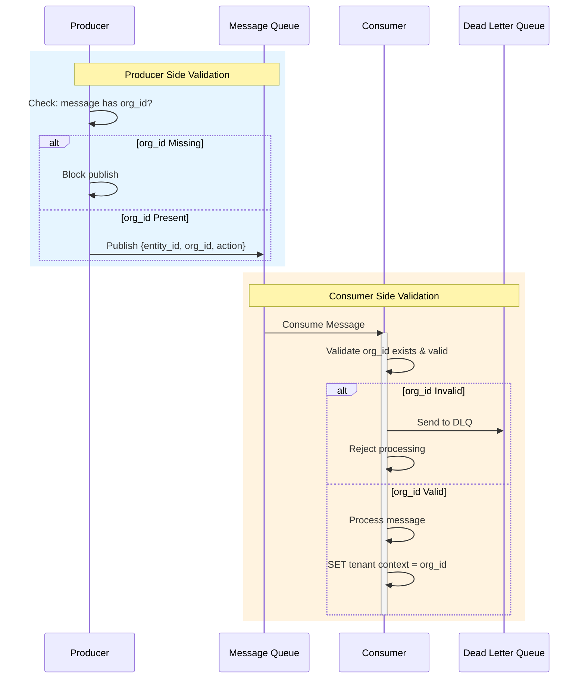
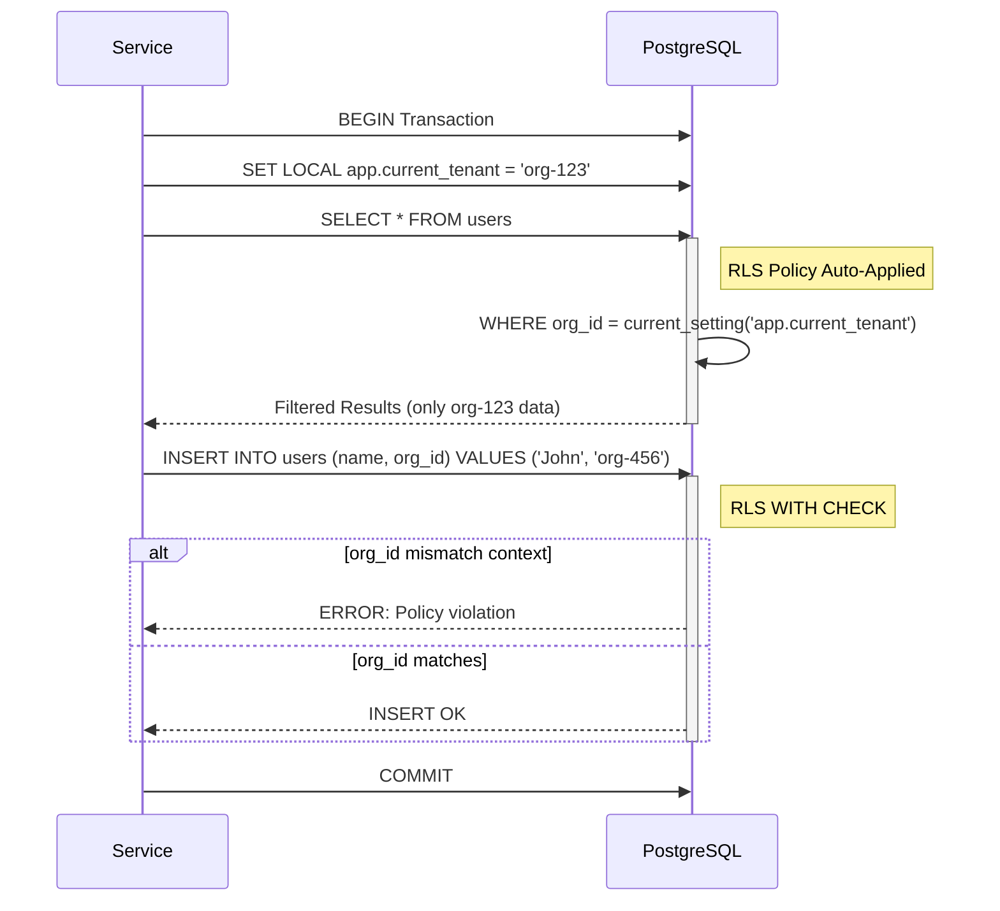

# Low-Level Design (LLD): Tenant Isolation Strategy

## 1. Cơ Sở Lý Thuyết & Mục Tiêu

Tài liệu này định nghĩa nền tảng kỹ thuật cho việc kiểm soát multi-tenancy, là tiền đề bắt buộc cho mọi service trong hệ thống.

**Mục tiêu cốt lõi:** Ngăn chặn truy cập chéo (Cross-tenant Access) tại mọi checkpoint.

## 2. Checkpoint Defense Architecture

Hệ thống áp dụng cơ chế bảo vệ tại 5 checkpoints cụ thể để đảm bảo tính toàn vẹn của dữ liệu tenant.



### 2.1 Checkpoint 1: Client App (Defensive Check)

- **Vai trò:** Phòng vệ bổ sung (Defensive Programming), không phải là điểm đảm bảo an ninh chính.
- **Cơ chế:**
  - Client App phải luôn kiểm tra sự tồn tại và hợp lệ của `org_id` trước khi thực hiện bất kỳ request nào.
  - Nếu phát hiện thiếu hoặc sai `org_id`:
    1.  Không hiển thị dữ liệu liên quan.
    2.  Không xử lý tiếp (cache/logic).
    3.  Chặn request gửi đi để giảm tải rác cho server.



### 2.2 Checkpoint 2: Service Inbound (Middleware/Filter)

- **Vị trí:** Service Middleware.
- **Cơ chế:**
  1.  **Token Requirement:** Mọi API của service đều yêu cầu có Token.
  2.  **S2S Fallback:** Nếu request không có Token người dùng (User Token) mà là giao tiếp nội bộ, chuyển tiếp cho xử lý tại **Checkpoint 3 (S2S)**.
  3.  **Validation Flow:**
      - Xác thực Token (Signature verification) để chống MITM.
      - Trích xuất Claims từ Token -> Trích xuất `org_id` và set vào header `X-Tenant-ID`.
      - **Validate Tenant:**
        - Org có đang active không?
        - User có thuộc Org này không?
  4.  **Kết quả:**
      - Thành công: Cho phép đi tiếp.
      - Thất bại: Trả về `401 Unauthorized` ngay lập tức.



### 2.3 Checkpoint 3: Service-to-Service (S2S)

- **Vị trí:** Giao tiếp giữa các microservices.
- **Cơ chế:**
  1.  **mTLS:** Bảo vệ kênh truyền, chống MITM.
  2.  **Header Extraction:** Trích xuất `org_id` từ header `X-Tenant-ID`.
  3.  **Validation:** Thực hiện validate `org_id` tương tự như quy trình tại **Checkpoint 2**.



### 2.4 Checkpoint 4: Service-to-Queue (Async Messaging)

- **Vị trí:** Message Broker (Producer & Consumer).
- **Cơ chế:**
  1.  **Producer Side:** Kiểm soát message trước khi gửi. Message bắt buộc phải chứa `org_id` hợp lệ. Nếu không -> Chặn publish.
  2.  **Consumer Side:** Thiết lập chốt chặn thứ 2.
      - Khi nhận message, consumer kiểm tra lại tính hợp lệ của `org_id`.
      - Nếu message không có `org_id` hợp lệ (trường hợp producer bị bypass), consumer **từ chối xử lý**.



### 2.5 Checkpoint 5: Service-to-Database (Data Access)

- **Vị trí:** Repository / Data Access Layer.
- **Cơ chế:** Chốt chặn cuối cùng bảo vệ dữ liệu.
  1.  **Global Repository Filter:** Luôn đưa điều kiện `org_id` match vào mọi câu query tại tầng ứng dụng (ORM scopes/filters).
  2.  **Row Level Security (RLS):** Cơ chế bảo vệ cứng tại Database (PostgreSQL Policy).



## Appendix

### A. Đặc Tả Dữ Liệu Tenant & Migration Strategy

Hiện tại, hệ thống vận hành với **1 Default Tenant (Reserved Tenant)**, nhưng kiến trúc cần sẵn sàng cho Multi-Tenancy.
Khi thực hiện migration, toàn bộ dữ liệu hiện hữu phải được gắn với Default Tenant này.

### A.1 Global Schema Requirement

```sql
-- Thêm cột org_id, đặt giá trị mặc định là Default Tenant ID cho dữ liệu cũ
ALTER TABLE [table_name]
ADD COLUMN org_id UUID NOT NULL
DEFAULT '00000000-0000-0000-0000-000000000000' -- Reserved Tenant UUID
REFERENCES organizations(id);

CREATE INDEX idx_[table_name]_org_id ON [table_name](org_id);
```

### B. RLS Implementation (PostgreSQL)

### B.1 Policy Definition

Mẫu Policy áp dụng cho các bảng cần bảo vệ:

```sql
-- 1. Kích hoạt RLS
ALTER TABLE [table_name] ENABLE ROW LEVEL SECURITY;

-- 2. Tạo Policy
CREATE POLICY [policy_name] ON [table_name]
    FOR ALL
    USING (
        -- Admin Role: Bypass Tenant Check (Middleware set context 'app.role', sau khi verify user)
        (current_setting('app.role', true) = 'admin')
        OR
        -- Standard Check: Dữ liệu phải khớp với Tenant Context hiện tại
        (org_id = current_setting('app.current_tenant')::uuid)
    )
    WITH CHECK (
        (current_setting('app.role', true) = 'admin')
        OR
        (org_id = current_setting('app.current_tenant')::uuid)
    );
```

### B.2 Sử dụng trong Transaction (Node.js / pg-pool)

```javascript
const client = await pool.connect();
try {
  await client.query("BEGIN");

  // Quan trọng: Set context ngay đầu transaction
  await client.query(`SET LOCAL app.current_tenant = $1`, ["org-123"]);

  // Các query sau đó sẽ tự động bị filter bởi Policy đã định nghĩa
  const res = await client.query("SELECT * FROM users");

  await client.query("COMMIT");
} catch (e) {
  await client.query("ROLLBACK");
  throw e;
} finally {
  client.release();
}
```
