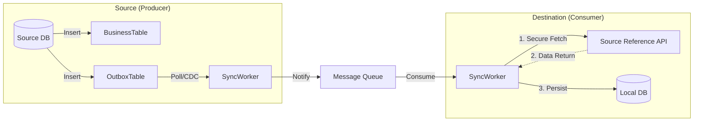

# Low-Level Design (LLD): Secure Data Synchronization

## 1. Giới Thiệu

Tài liệu này mô tả cơ chế đồng bộ dữ liệu giữa các system/service, đảm bảo tuyệt đối không truyền PII qua Message Queue.
**Tiền đề:** Hệ thống tuân thủ thiết kế [1_LLD_TENANT_ISOLATION.md](./1_LLD_TENANT_ISOLATION.md).

## 2. Chiến Lược Đồng Bộ: Reference-Based Sync

Thay vì gửi "Data Payload", chúng ta gửi "Notification Payload".

### 2.1 Luồng Xử Lý (End-to-End Flow)



## 3. Các Phương Án Triển Khai (Implementation Options)

Dựa trên hạ tầng hiện tại (**1 EC2 Instance + Auto-scaling**, PostgreSQL), có 2 phương án chính để publish event.

### Option 1: Transactional Outbox Pattern (Polling Publisher) - **RECOMMENDED**

Đây là phương án phù hợp nhất với hạ tầng đơn giản (1 EC2), dễ triển khai và vận hành mà không cần thêm component phức tạp (Kafka Connect/Debezium).

#### 3.1 Cơ Chế Hoạt Động

1.  **Dual Write (Atomicity):** Trong cùng 1 transaction DB, App ghi vào bảng Business (Users) VÀ bảng `outbox`.
    - Đảm bảo: Nếu User tạo thành công -> Event chắc chắn nằm trong Outbox.
2.  **Polling Publisher (Worker):** Một Background Worker (chạy trên chính EC2 instance) quét bảng `outbox` và publish sang Queue.

#### 3.2 Xử Lý Concurrency (Auto-scaling Safe)

Để đảm bảo **nhiều instance EC2** cùng chạy worker mà không duplicate event, ta sử dụng cơ chế **Locking**:

```sql
SELECT * FROM outbox
WHERE status = 'PENDING'
ORDER BY created_at ASC
LIMIT 50
FOR UPDATE SKIP LOCKED; -- Key Magic: Bỏ qua row đang bị instance khác lock
```

#### 3.3 Implementation Details

- **Table Schema:** `outbox (id, aggregate_type, aggregate_id, type, payload, status, created_at)`
- **Trigger (Optional):** Có thể dùng Trigger để tự động insert vào Outbox (giảm code App).
- **Worker Code:** (Xem mục Section 5).

---

### Option 2: Log-Based CDC (Change Data Capture)

Phương án này tách biệt hoàn toàn việc publish event ra khỏi Application Code, sử dụng các công cụ chuyên dụng đọc Transaction Log (WAL).

#### 3.4 Cơ Chế Hoạt Động

1.  **Single Write:** App chỉ insert vào bảng Business. Transaction commit bình thường.
2.  **Log Miner:** Một service riêng biệt (Debezium / AWS DMS / PG Replication Slot Reader) đọc WAL của PostgreSQL.
3.  **Parser & Push:** Service này parse log thành event và đẩy sang Queue.

#### 3.5 Hạ Tầng Yêu Cầu

- Cần triển khai thêm cụm **Kafka Connect + Debezium** hoặc chạy một **Stand-alone CDC Service** (viết bằng Go/Java/Rust) để đọc Replication Slot.
- **Khó khăn với 1 EC2:** Việc chạy thêm CDC Service trên cùng EC2 khiến việc deploy/scale phức tạp hơn. Nếu chạy tách biệt thì tốn thêm chi phí hạ tầng.

---

## 4. Phân Tích & Win-Condition (Trade-off Analysis)

| Tiêu Chí                         | Option 1: Transactional Outbox (Polling)       | Option 2: Log-Based CDC                              |
| :------------------------------- | :--------------------------------------------- | :--------------------------------------------------- |
| **Tính Nhất Quán (Consistency)** | **Cao (Atomic DB Transaction)**                | **Cao (Dựa trên WAL log)**                           |
| **Độ Phức Tạp Hạ Tầng**          | **Thấp** (Dùng chính App EC2 & DB hiện tại)    | **Cao** (Cần setup Debezium/Kafka/Replication Slots) |
| **Khả Năng Scale (App)**         | **Tốt** (Dùng `SKIP LOCKED` để chạy song song) | **Tốt** (Không ảnh hưởng App)                        |
| **Performance Impact**           | Trung bình (Tốn resource DB cho query polling) | Thấp (Chỉ đọc Log, không query DB)                   |
| **Operation Effort**             | Thấp (Monitor như 1 API thông thường)          | Cao (Monitor thêm CDC Service, offset lag...)        |
| **Phù Hợp Với Team**             | **Phù hợp (Code-centric)**                     | Cần kiến thức Data Engineering / Infra sâu hơn       |

**Kết Luận:** Với constraint **1 EC2 + Auto-scaling**, team nên chọn **Option 1 (Transactional Outbox)**.

- Lý do: Tận dụng code logic có sẵn, dễ debug, không tốn thêm tiền server.
- Đường lui: Khi hệ thống lớn (hàng triệu RPM), có thể chuyển sang Option 2 mà không cần sửa logic App (chỉ cần tắt Worker polling và bật CDC tool đọc bảng Outbox).

## 5. Đặc Tả Chi Tiết (Cho Option 1)

### 5.1 Outbox Table Schema

```sql
CREATE TABLE outbox (
    id UUID PRIMARY KEY DEFAULT gen_random_uuid(),
    aggregate_type VARCHAR(255) NOT NULL, -- e.g., 'USER'
    aggregate_id VARCHAR(255) NOT NULL,   -- e.g., 'u-123'
    type VARCHAR(255) NOT NULL,           -- e.g., 'UPDATED'
    payload JSONB NOT NULL,               -- Metadata only!
    status VARCHAR(50) DEFAULT 'PENDING', -- 'PENDING', 'PUBLISHED'
    created_at TIMESTAMP WITH TIME ZONE DEFAULT NOW()
);
CREATE INDEX idx_outbox_pending ON outbox(created_at) WHERE status = 'PENDING';
```

### 5.2 Notification Event Format (Queue Message)

```json
{
  "event_id": "evt-12345",
  "entity": {
    "type": "USER",
    "id": "u-999"
  },
  "action": "PROFILE_UPDATE",
  "timestamp": "2026-02-08T10:00:00Z",
  "source_system": "IDENTITY_SERVICE",
  "tenant_context": {
    "org_id": "org-abc"
  }
}
```

### 5.3 Polling Worker (Node.js)

```javascript
// Chạy định kỳ (e.g., node-cron hoặc setInterval 500ms)
async function processOutboxEvents() {
  const client = await pool.connect();
  try {
    await client.query("BEGIN");

    // 1. Fetch & Lock (Concurrency Safe for Auto-scaling)
    const res = await client.query(`
      SELECT * FROM outbox 
      WHERE status = 'PENDING' 
      ORDER BY created_at ASC 
      LIMIT 50 
      FOR UPDATE SKIP LOCKED
    `);

    if (res.rows.length > 0) {
      // 2. Publish to Queue
      for (const event of res.rows) {
        await rabbitMQ.publish("exchange", "routingKey", event.payload);
      }
      // 3. Update Status
      const ids = res.rows.map((r) => r.id);
      await client.query(
        `UPDATE outbox SET status = 'PUBLISHED' WHERE id = ANY($1)`,
        [ids],
      );
    }
    await client.query("COMMIT");
  } catch (e) {
    await client.query("ROLLBACK");
    console.error("Outbox Error", e);
  } finally {
    client.release();
  }
}
```

## 6. Consumer Implementation & Error Handling

### 6.1 Secure Reference API Interface

API cung cấp dữ liệu chi tiết cho consumer đã xác thực.

- **Endpoint:** `GET /internal/sync/{entity_type}/{id}`
- **Security Headers:**
  - `Authorization`: Bearer Token (Service-to-Service).
  - `X-Consumer-ID`: ID của service gọi.
  - `X-Tenant-ID`: Context tenant bắt buộc (kế thừa từ LLD Tenant).
- **Behavior:**
  1.  Validate Token & mTLS.
  2.  Set DB Context (`app.current_tenant`).
  3.  Query DB (RLS sẽ tự động filter).
  4.  Trả về Full Data (bao gồm PII) qua kênh encrypted (HTTPS).

### 6.2 Retry Strategy

- **Fetch Failed (Network/5xx):** Retry với Exponential Backoff (Backoff factor 1.5).
- **Data Not Found (404):**
  - Có thể do Replication Lag (Source chưa commit xong nhưng CDC đã bắt được - hiếm gặp).
  - Retry 3 lần. Nếu vẫn 404 -> Log Warning & Drop (hoặc đưa vào DLQ điều tra).
- **Unauthorized (401/403):** Critical Error -> Alert ngay lập tức (Sai cấu hình mTLS/Token).
- **Consistency Check:** Chạy định kỳ job `Reconciliation` để quét lệch pha.

### 6.3 Xử Lý Concurrency (Auto-scaling Safe)

Khi Consumer Service scale lên nhiều instances (Auto-scaling), chúng ta cần đảm bảo:

1.  **Không xử lý trùng lặp (No Duplicate Processing):**
    - Tất cả Consumer instances phải thuộc cùng một **Consumer Group**.
    - Message Queue (RabbitMQ/Kafka) sẽ đảm bảo mỗi message chỉ được deliver cho **duy nhất một instance** trong group tại một thời điểm.

2.  **Xử lý Out-of-Order (Final Consistency):**
    - Dù không bị duplicate, nhưng message có thể đến không đúng thứ tự (do retry hoặc network latency).
    - Để đảm bảo tính toàn vẹn, áp dụng **Optimistic Locking**:
      - **Local DB Schema:** Bảng đích phải có cột `last_synced_at` (TIMESTAMP).
      - **Logic Update:** Chỉ cập nhật nếu `event.timestamp >= current_record.last_synced_at`.

      ```sql
      -- Ví dụ Upsert an toàn
      INSERT INTO local_users (id, name, last_synced_at)
      VALUES ($1, $2, $3)
      ON CONFLICT (id) DO UPDATE
      SET
        name = EXCLUDED.name,
        last_synced_at = EXCLUDED.last_synced_at
      WHERE local_users.last_synced_at < EXCLUDED.last_synced_at;
      ```

      Nếu điều kiện `WHERE` không thỏa mãn (Event cũ hơn dữ liệu hiện tại), Database sẽ bỏ qua lệnh Update.

## Appendix

### A. Automation Trigger (Optional for Option 1)

Nếu không muốn code `INSERT INTO outbox` trong mọi Service function, có thể dùng Trigger:

```sql
CREATE OR REPLACE FUNCTION notify_changes() RETURNS TRIGGER AS $$
BEGIN
    INSERT INTO outbox (aggregate_type, aggregate_id, type, payload)
    VALUES (TG_ARGV[0], NEW.id, TG_OP, json_build_object('timestamp', NOW()));
    RETURN NEW;
END;
$$ LANGUAGE plpgsql;

-- Attach to Users table
CREATE TRIGGER user_changes AFTER INSERT OR UPDATE ON users
FOR EACH ROW EXECUTE FUNCTION notify_changes('USER');
```

### B. mTLS (Service-to-Service)

### B.1 Dual Port Strategy (Recommended)

Để tách biệt rõ ràng traffic và chính sách bảo mật, Service nên lắng nghe trên 2 ports (cả 2 đều có thể là Public):

- **TLS Server (e.g., 8080):** Dành cho Inbound traffic từ Client/Gateway. (Xác thực User Token).
- **mTLS Server (e.g., 8441):** Dành riêng cho traffic Service-to-Service. **BẮT BUỘC mTLS**.

### B.2 Tạo Root CA & Certificates (OpenSSL)

```bash
# 1. Generate CA Key & Cert
openssl req -new -x509 -days 9999 -keyout ca.key -out ca.crt

# 2. Server Key & CSR (Source System)
openssl req -new -keyout server.key -out server.csr -subj "/CN=source-service"

# 3. Sign Server Cert
openssl x509 -req -in server.csr -CA ca.crt -CAkey ca.key -CAcreateserial -out server.crt

# 4. Client Key & CSR (Consumer System)
openssl req -new -keyout client.key -out client.csr -subj "/CN=consumer-service"

# 5. Sign Client Cert
openssl x509 -req -in client.csr -CA ca.crt -CAkey ca.key -CAcreateserial -out client.crt
```

### B.3 Node.js Implementation Code Snippet

**Server Side (Dual Port Setup):**

```javascript
const https = require("https");
const http = require("http");
const fs = require("fs");

// 1. mTLS Server (Public - mTLS Required) - Port 8441
const mtlsOptions = {
  key: fs.readFileSync("server.key"),
  cert: fs.readFileSync("server.crt"),
  ca: fs.readFileSync("ca.crt"),
  requestCert: true,
  rejectUnauthorized: true, // Fail nếu không có Client Cert hợp lệ
};

https
  .createServer(mtlsOptions, (req, res) => {
    // Check Client Cert Identity (CN)
    const cert = req.socket.getPeerCertificate();
    if (req.client.authorized) {
      console.log(`mTLS Access Granted: ${cert.subject.CN}`);
      // ... Logic xử lý nội bộ ...
      res.writeHead(200);
      res.end("Internal Data");
    } else {
      res.writeHead(401);
      res.end("Unauthorized");
    }
  })
  .listen(8441, () => console.log("mTLS Server running on 8441"));

// 2. TLS Server (Standard HTTP/TLS) - Port 8080
http
  .createServer((req, res) => {
    // ... Logic xác thực User Token thông thường ...
    console.log("TLS Public Access");
    res.writeHead(200);
    res.end("Public Data");
  })
  .listen(8080, () => console.log("TLS Server running on 8080"));
```

**Client Side (mTLS Request):**

```javascript
const https = require("https");
const fs = require("fs");

// Client Certificate Configuration
const clientOptions = {
  hostname: "source-service",
  port: 8441,
  path: "/internal/sync/user/u-123",
  method: "GET",
  key: fs.readFileSync("client.key"), // Client Private Key
  cert: fs.readFileSync("client.crt"), // Client Certificate
  ca: fs.readFileSync("ca.crt"), // CA Certificate (để verify server)
  rejectUnauthorized: true, // Verify server certificate
  headers: {
    "X-Tenant-ID": "org-abc",
    "X-Consumer-ID": "consumer-service",
  },
};

const req = https.request(clientOptions, (res) => {
  let data = "";
  res.on("data", (chunk) => (data += chunk));
  res.on("end", () => {
    console.log("Response:", JSON.parse(data));
  });
});

req.on("error", (e) => {
  console.error("mTLS Request Failed:", e.message);
});

req.end();
```

**Client Side (Axios - Recommended for Production):**

```javascript
const axios = require("axios");
const https = require("https");
const fs = require("fs");

// Create HTTPS Agent with Client Certificate
const httpsAgent = new https.Agent({
  key: fs.readFileSync("client.key"),
  cert: fs.readFileSync("client.crt"),
  ca: fs.readFileSync("ca.crt"),
  rejectUnauthorized: true,
});

// Make mTLS Request
async function fetchUserFromSource(userId, tenantId) {
  const response = await axios.get(
    `https://source-service:8441/internal/sync/user/${userId}`,
    {
      httpsAgent,
      headers: {
        "X-Tenant-ID": tenantId,
        "X-Consumer-ID": "consumer-service",
      },
    },
  );
  return response.data;
}
```
