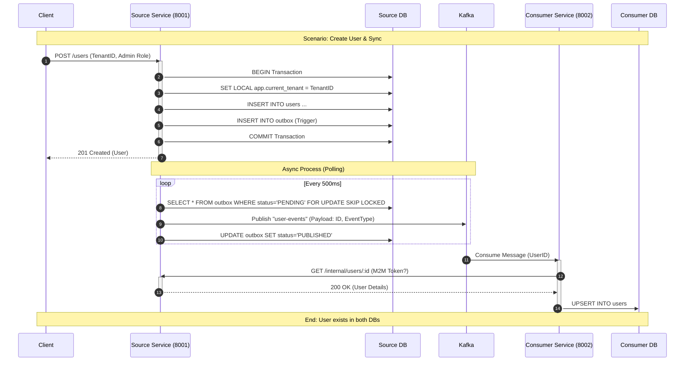

# Multi-Tenant Data Sync Demo

Triển khai thực tế cho 2 LLD documents:

- **LLD Tenant Isolation**: Checkpoint Defense architecture với RLS
- **LLD Data Sync**: Reference-Based Sync với Transactional Outbox Pattern

## Architecture

```
┌─────────────────────────────────────────────────────────────────────┐
│                        Source Service (8001)                        │
│  ┌──────────────┐  ┌──────────────┐  ┌──────────────────────────┐  │
│  │  REST API    │  │   Outbox     │  │   PostgreSQL 16          │  │
│  │  + Tenant    │──│   Worker     │──│   + RLS Policies         │  │
│  │  Middleware  │  │  (Polling)   │  │   + Outbox Table         │  │
│  └──────────────┘  └──────┬───────┘  └──────────────────────────┘  │
│                           │                                         │
└───────────────────────────┼─────────────────────────────────────────┘
                            ▼
                    ┌───────────────┐
                    │  Kafka KRaft  │
                    │  (No ZK)      │
                    └───────┬───────┘
                            ▼
┌───────────────────────────────────────────────────────────────────┐
│                      Consumer Service (8002)                       │
│  ┌──────────────┐  ┌──────────────┐  ┌────────────────────────┐  │
│  │   Kafka      │  │  Reference   │  │   Local Cache DB       │  │
│  │   Consumer   │──│  API Client  │──│   (user_cache table)   │  │
│  │              │  │  (Retry)     │  │                        │  │
│  └──────────────┘  └──────────────┘  └────────────────────────┘  │
└───────────────────────────────────────────────────────────────────┘
```

## Quick Start

### 1. Start Infrastructure

```bash
cd demo
docker-compose up -d
```

### 2. Generate mTLS Certificates

```bash
chmod +x demo/certs/gen-certs.sh
./demo/certs/gen-certs.sh
```

### 3. Install Dependencies

```bash
npm run install:all
```

### 4. Run Migrations

```bash
npm run migrate:all
```

### 5. Start Services

Terminal 1 (Source Service):

```bash
npm run start:source
```

Terminal 2 (Consumer Service):

```bash
npm run start:consumer
```

## Testing

### Unit Tests

```bash
npm run test:unit
```

### Integration Tests (requires Docker)

```bash
npm run test:integration
```

## Demo Scenarios

### Sequence Diagram



### 1. Create User with Tenant Isolation

```bash
# Create user (tenant: default)
curl -X POST http://localhost:8001/users \
  -H "Content-Type: application/json" \
  -H "X-Tenant-ID: 00000000-0000-0000-0000-000000000000" \
  -d '{"name": "Demo User", "email": "demo@example.com"}'
```

### 2. Verify Outbox Event

```bash
docker exec -it demo-postgres psql -U demo -d source_db \
  -c "SELECT id, aggregate_type, event_type, status FROM outbox ORDER BY created_at DESC LIMIT 5;"
```

### 3. View Synced Data in Consumer

```bash
curl http://localhost:8002/cache/users
```

### 4. Test Cross-Tenant Block (should fail)

```bash
# Try accessing with different tenant - should return empty
curl http://localhost:8001/users \
  -H "X-Tenant-ID: 11111111-1111-1111-1111-111111111111"
```

## LLD Implementation Mapping

| LLD Concept            | Implementation                                 |
| ---------------------- | ---------------------------------------------- |
| Checkpoint 1 (Client)  | _(Not in this demo)_                           |
| Checkpoint 2 (Inbound) | `TenantContextMiddleware.ts`                   |
| Checkpoint 3 (S2S)     | `InternalSyncController.ts`                    |
| Checkpoint 4 (Queue)   | `UserEventConsumer.ts`                         |
| Checkpoint 5 (DB)      | RLS Policies in `003_rls_policies.sql`         |
| Transactional Outbox   | `004_outbox.sql` + Trigger                     |
| SKIP LOCKED            | `PgOutboxRepository.fetchPendingWithLock()`    |
| Reference-Based Sync   | `SyncUserUseCase.ts` + `ReferenceApiClient.ts` |

## Clean Architecture Layers

```
domain/           # Entities, Repository Interfaces, Value Objects
application/      # Use Cases, Services, Interfaces
infrastructure/   # PostgreSQL, Kafka, Workers
presentation/     # HTTP Controllers, Middleware, Routes
```
