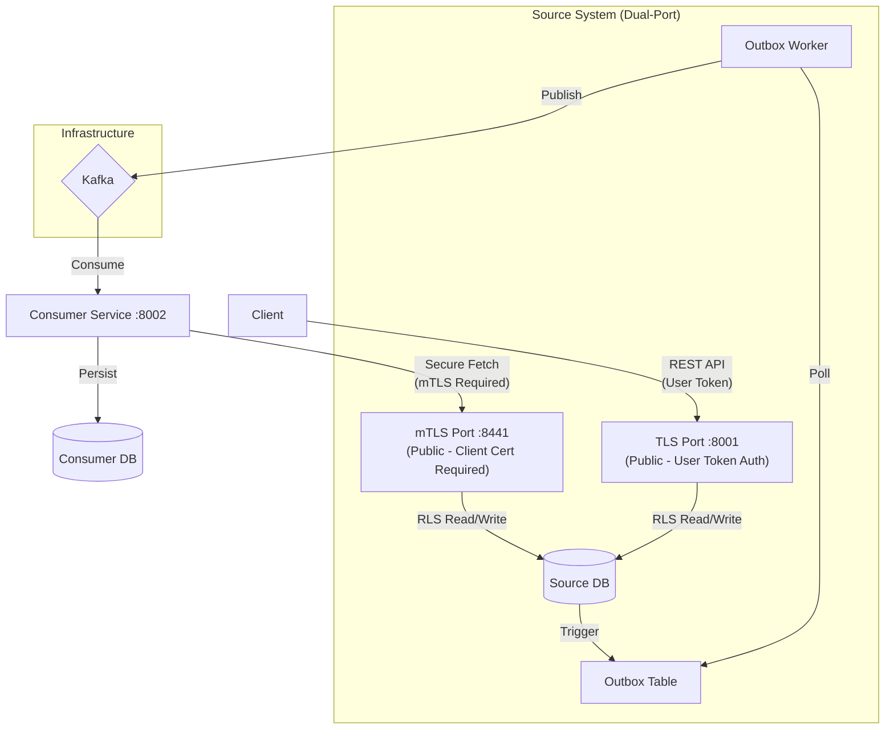
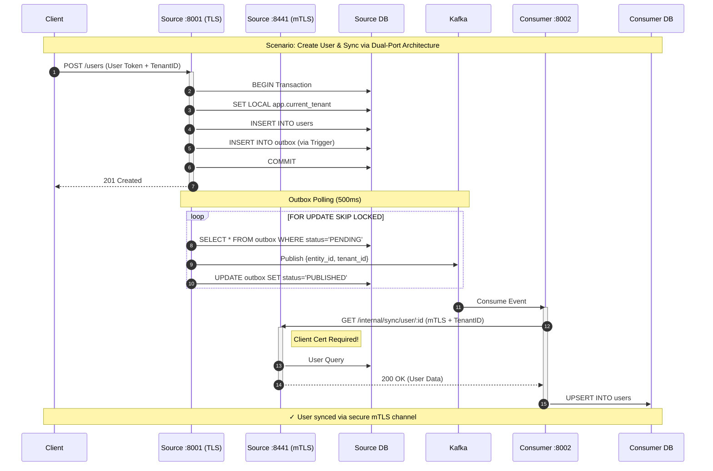

# Multi-Tenant Data Sync Demo

Triển khai thực tế cho 2 LLD documents:

- **LLD Tenant Isolation**: Checkpoint Defense architecture với RLS
- **LLD Data Sync**: Reference-Based Sync với Transactional Outbox Pattern

## Architecture



## Quick Start

### 1. Start Infrastructure

```bash
cd demo
docker-compose up -d
```

### 2. Generate mTLS Certificates (Required)

mTLS certificates are **required** for S2S communication:

```bash
chmod +x demo/certs/gen-certs.sh
./demo/certs/gen-certs.sh
```

The generated certificates enable secure communication between Consumer Service and Source Service's internal API on port 8441.

### 3. Create Environment Files

```bash
cp source-service/.env.example source-service/.env
cp consumer-service/.env.example consumer-service/.env
```

### 4. Install Dependencies

```bash
npm run install:all
```

### 5. Run Migrations

```bash
npm run migrate:all
```

### 6. Start Services

Terminal 1 (Source Service):

```bash
npm run start:source
```

Terminal 2 (Consumer Service):

```bash
npm run start:consumer
```

## Testing

### Unit Tests

```bash
npm run test:unit
```

### Integration Tests (requires Docker)

```bash
npm run test:integration
```

## Demo Scenarios

### Sequence Diagram



### 1. Create User (via TLS Port :8001)

```bash
# Create user via public TLS API
curl -X POST http://localhost:8001/users \
  -H "Content-Type: application/json" \
  -H "X-Tenant-ID: 00000000-0000-0000-0000-000000000000" \
  -H "X-User-Role: admin" \
  -d '{"name": "Demo User", "email": "demo@example.com"}'
```

### 2. Verify Outbox Event

```bash
docker exec -it demo-postgres psql -U demo -d source_db \
  -c "SELECT id, aggregate_type, event_type, status FROM outbox ORDER BY created_at DESC LIMIT 5;"
```

### 3. View Synced Data (Consumer fetched via mTLS :8441)

```bash
curl http://localhost:8002/cache/users
```

```bash
docker exec -it demo-postgres psql -U demo -d consumer_db \
  -c "SELECT * FROM users;"
```

### 4. Test Cross-Tenant Block (RLS)

```bash
# Try accessing with different tenant - should return empty
curl http://localhost:8001/users \
  -H "X-Tenant-ID: 11111111-1111-1111-1111-111111111111"
```

## LLD Implementation Mapping

| LLD Concept            | Implementation                                 |
| ---------------------- | ---------------------------------------------- |
| Checkpoint 2 (Inbound) | `TenantContextMiddleware.ts`                   |
| Checkpoint 3 (S2S)     | `InternalSyncController.ts` + mTLS :8441       |
| Checkpoint 4 (Queue)   | `UserEventConsumer.ts`                         |
| Checkpoint 5 (DB)      | RLS Policies in `003_rls_policies.sql`         |
| Transactional Outbox   | `004_outbox.sql` + Trigger                     |
| Dual-Port Strategy     | `main.ts` (TLS :8001 + mTLS :8441)             |
| SKIP LOCKED            | `PgOutboxRepository.fetchPendingWithLock()`    |
| Reference-Based Sync   | `SyncUserUseCase.ts` + `ReferenceApiClient.ts` |

## Project Structure

```
demo/
├── docker-compose.yml          # PostgreSQL + Kafka infrastructure
├── docker/
│   └── init-scripts/           # DB init scripts (create consumer_db)
├── certs/                      # mTLS certificates
│   ├── gen-certs.sh            # Certificate generation script
│   ├── ca.crt, ca.key          # Root CA
│   ├── server.crt, server.key  # Source Service (mTLS server)
│   └── client.crt, client.key  # Consumer Service (mTLS client)
│
├── source-service/             # Producer Service (Dual-Port)
│   └── src/
│       ├── main.ts             # Entry point (TLS:8001 + mTLS:8441)
│       ├── domain/             # Entities, Repository Interfaces
│       │   ├── entities/       # User, OutboxEvent
│       │   └── repositories/   # IUserRepository, IOutboxRepository
│       ├── application/        # Use Cases, Services
│       │   ├── use-cases/      # CreateUserUseCase
│       │   └── services/       # TenantContextService
│       ├── infrastructure/     # External Dependencies
│       │   ├── database/       # PostgresConnection, Repositories, Migrations
│       │   ├── messaging/      # KafkaPublisher
│       │   └── workers/        # OutboxPollingWorker
│       └── presentation/       # HTTP Layer
│           ├── http/           # Express server, routes
│           │   ├── controllers/# UserController, InternalSyncController
│           │   ├── middleware/ # TenantContextMiddleware
│           │   └── routes/     # Public + Internal routes
│
├── consumer-service/           # Consumer Service
│   └── src/
│       ├── main.ts             # Entry point (HTTP:8002)
│       ├── domain/             # CachedUser entity
│       ├── application/        # SyncUserUseCase
│       └── infrastructure/
│           ├── database/       # UsersRepository, Migrations
│           ├── http/           # ReferenceApiClient (mTLS client)
│           └── kafka/          # UserEventConsumer
│
└── tests/
    ├── unit/                   # Unit tests
    └── integration/            # Full sync flow tests
```

## Clean Architecture Layers

| Layer             | Responsibility                                 |
| ----------------- | ---------------------------------------------- |
| `domain/`         | Entities, Repository Interfaces, Value Objects |
| `application/`    | Use Cases, Application Services                |
| `infrastructure/` | PostgreSQL, Kafka, HTTP Clients, Workers       |
| `presentation/`   | Express Controllers, Middleware, Routes        |
